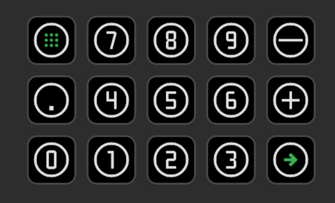

# Stream Deck Material Numpad

A customized Stream Deck profile featuring a clean, modern numpad layout based on Google's Material Design principles. This profile transforms your Stream Deck into an elegant number pad with visually consistent icons.

## Installation

1. Download the latest release from this repository
2. Double-click the profile file to open it with the Stream Deck software
3. The profile will be automatically imported into your Stream Deck application
4. Connect your Stream Deck device to see the numpad layout

## Included Icons

This profile includes the following Material Design numpad icons:

- Numbers 0-9
- Mathematical operators (+, -, ×, ÷)
- Enter/Return key
- Decimal point
- Backspace/Delete
- Clear/Reset

All icons feature consistent styling with Material Design's clean aesthetic for a professional appearance on your Stream Deck.

## Credits

Icons are based on [Google's Material Design Icons](https://fonts.google.com/icons), modified specifically for Stream Deck. Material Design is Google's open-source design system that provides visual guidelines for creating digital experiences.

